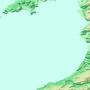

# Bathymetry Plot
Program to plot and visualise Bathymetric Data. Featuring a GUI with the
hopes that the program will be applicable to other areas that benefit
from 3D mapping and heat maps.

## Contents
- [About](#about)
- [The Data](#the-data)
- [Packages](#packages)

## About
Having previously been made aware of a similar project, but not having
the opportunity to do it. I have decided to pursue this in my own time.
The idea of the project is to build an executable, distributable, and
(hopefully) use-able program, that plots 3D mesh graphs of Bathymetric
Data stylised with a color scheme, similar to that of heat maps, to help
show altitudes relative to sea level. Fully complete with documentation
and a decent Git repository.

## The Data
The data has been obtained from [GEBCO - The General Bathymetric Chart
of the Oceans](https://www.gebco.net/). The site has an interactive map
that allows the user to specify an area on the globe from which they wish
to pull their data.

In this instance I have selected [Cardigan Bay](https://en.wikipedia.org/wiki/Cardigan_Bay) to develop the project with,
this is simply because it is close to where I attended university, and is
loosely based on what the original project was.

The download from the site contains (among other things) an ASCII file
containing the depth in meters above sea level, at 15 meter intervals. For
the sake of visual re-assurance I have included a small amount of land mass
in the data, just to make the plots a little more interesting and also to
add a means of assuring what the plot generates is accurate (essentially as
a means of testing).

Below is a JPEG image of the area that was selected, for clarity:

## Packages
Below, are the packages used to help create the project:
- matplot - https://matplotlib.org/stable/
- pandas - https://pandas.pydata.org/
- pydoc - https://docs.python.org/3/library/pydoc.html
- tkinter - https://docs.python.org/3/library/tkinter.html
