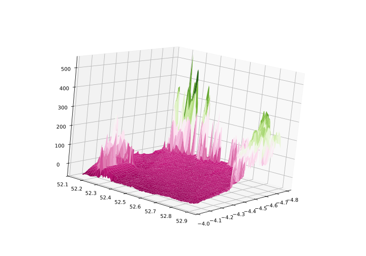
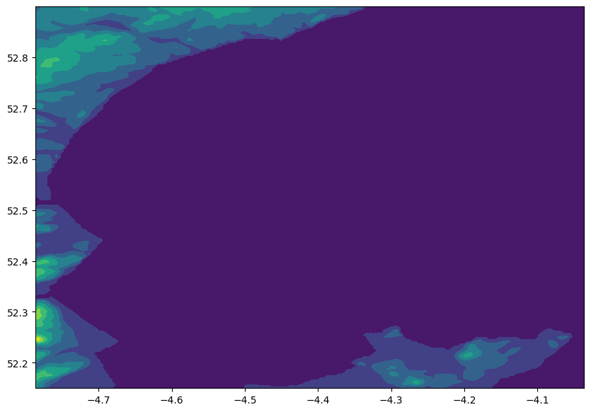
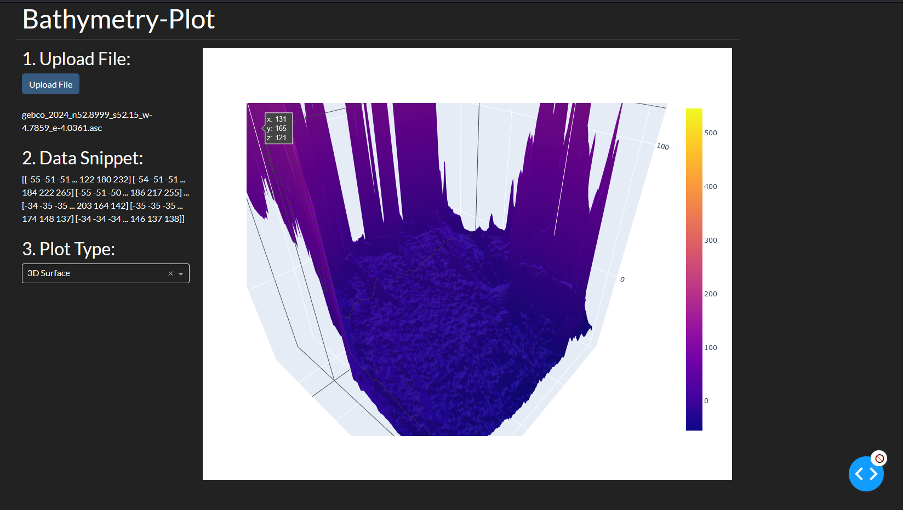

# Dev Logs/Diary

To log commits and generally what was undertaken in a given day during the course of the
project.

---

> ## 07/01/2025
> ### Genesis
> This was the day the repo was created. Along with this I wrote the bare bones of the
> ``README``. I used this to help me steer a course and decide on the main goals for the
> project. I collated all the resources I had used as 'research' into one place and
> generally, established with myself, what I intended to do in the coming days.

> ## 08/01/2025
> I started writing the essentials. Loading data from files, creating ``Tkinter`` windows, 
> and remembering how to plot with ``Matplot``. At this point, using one set of data I have
> only implemented the ability to read in one file type. This will change later if all
> goes well. Learning ``Tkinter`` was a slower process, but I have the beginnings of a main
> window and a button.

> ## 09/01/2025
> After learning the basics, I spent the day creating ``Matplot`` plots within ``Tkinter`` windows
> using ``FigureCanvasTkAgg``. Today was a short day, I finished with a second button that
> generated the plot window with a simple line graph inside.

> ## 10/01/2025
> A Google heavy day. I wanted to start passing data collected from ``main.py`` to
> ``plot.py``. This was easier said than done since the latter imported the former.
> Eventually, I settled for a class inside ``plot.py`` that was instantiated in ``main.py``,
> this works quite well. Once I had achieved this, I wanted to move on to generating better
> plots, with the hope of being able to see the basic - bottom level - process from start
> to finish. I managed to plot a 3D mesh with ``Matplot``. But didn't have the time to
> incorporate data from a loaded file, although it is now accessible by ``plot.py``.
> A task for another day.

> ## 11/01/2025
> ### The First
> Today saw alot of work finishing off the data transfer from ``main.py`` to ``plot.py``.
> Crucially though, once this was complete. The day finished with the first plots generated
> from raw data. Initially with the practice data of Cardigan Bay, plots were then generated
> from other data sets to assess the ability of the program to read filenames. Both were
> successful. There is however an issue with regenerating the plot once the window has been closed
> (without loading fresh data). Now with an application that can run from start to finish
> (albeit primitively) hopefully progress on adapting it and improving it will be swift.
> Below is the first plot generated:



> ## 12/01/2025
> Did some small refinements, making the UI more responsive and easier to run on different
> systems. Some functionality with the plots still doesn't work but also doesn't seem to tricky
> to fix. Started thinking about what other options I want to add to the first window to allow
> the user to customize the parameters for the plots they wish to generate.

> ## 13/01/2025
> Spent alot of the day optimising the ```PlotConfig()``` class as to avoid an
> instantiation of the class in ```main.py```. In the afternoon I was reworking the UI to
> CustomTkinter since it looks alot nicer. I managed to get back to the state the project was
> in prior to the change which was the main task of the day. Moreover, I started implementing
> customization options so the user can customize the output of the plot.

> ## 14/01/2025
> Today saw a doubling down on adding customization features. Largely to do with the type of
> plot. Ultimately, this resulted in a second type of plot being an option for the user - contour
> plots. These are 2-dimensional and as such not as complex to generate. A good development
> from this would be to generate the plots on the same figure. Although this might mean that
> the current interactive nature of the 3D plots when rendered on their own, won't be possible
> when rendered together. Finally, I discovered Plotly, I hope to remove MatPlot and integrate
> this instead, the plots are significantly improved.



> ## 15/01/2025
> I have decided to move forward with creating a web app, rather than a native one, using dash
> and plotly. Firstly, the graphs are much nicer to use and look at, second, Tkinter allows
> for the loading of webpages through one of its widgets. By creating a web version I can now
> create, effectively two apps, a native/local download version, and a web version. In terms of
> use-ability and distribution, this will be incredible. I have started researching what I can
> save from the current state of the project, what needs to be re-written, and most importantly
> how to start using dash to create the UI, and how to deploy it publicly at the conclusion of
> development.

> ## 16/01/2025
> Started trialing, and implementing Dash and corresponding packages to develop a new web based
> UI. Have made a very simple app at the moment, taking in user responses or as Dash refers to
> it ```callbacks```. Having spent alot of time reading docs today, tomorrow will hopefully be
> more about writing the actual UI, and starting to get it looking how I want it to. Does feel
> like I am back to square one with just about everything. Struggled alot with uploading data
> from local to webapp because Dash handles data in Binary. Simplest solution is to move the
> data locally into the project directory, although this is not the solution I want or the one
> that best serves the overall goals of the project.
> 
> <em>UPDATE: Today has been a late finish, I spent alot of the late afternoon/evening
> working on reading ASCII files in the ```dcc.Upload()``` widget. This proved difficult
> but at present the project is at a stage where ASCII files can be read by the app and
> processed into Numpy ```ndarrays```. Yet to implement actually reading this data into a
> plot.</em>

> ## 17/01/2025
> Implemented data reading from upload and can now generate a plot from the loaded data. I also
> spent a large portion of the day learning Dash Bootstrap to style the app. It is now at a
> primitive stage where it is looking <em>okay</em> and loading and reading data. The full
> process from start to finish. The next step is implementing other functionality and testing
> against other data sets (to make sure this isn't a fluke.)


