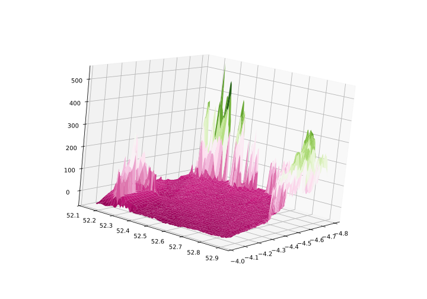

# Dev Logs/Diary

To log commits and generally what was undertaken in a given day during the course of the
project.

---

> ## 07/01/2025
> ### Genesis
> This was the day the repo was created. Along with this I wrote the bare bones of the
> ``README``. I used this to help me steer a course and decide on the main goals for the
> project. I collated all the resources I had used as 'research' into one place and
> generally, established with myself, what I intended to do in the coming days.

> ## 08/01/2025
> I started writing the essentials. Loading data from files, creating ``Tkinter`` windows, 
> and remembering how to plot with ``Matplot``. At this point, using one set of data I have
> only implemented the ability to read in one file type. This will change later if all
> goes well. Learning ``Tkinter`` was a slower process, but I have the beginnings of a main
> window and a button.

> ## 09/01/2025
> After learning the basics, I spent the day creating ``Matplot`` plots within ``Tkinter`` windows
> using ``FigureCanvasTkAgg``. Today was a short day, I finished with a second button that
> generated the plot window with a simple line graph inside.

> ## 10/01/2025
> A Google heavy day. I wanted to start passing data collected from ``main.py`` to
> ``plot.py``. This was easier said than done since the latter imported the former.
> Eventually, I settled for a class inside ``plot.py`` that was instantiated in ``main.py``,
> this works quite well. Once I had achieved this, I wanted to move on to generating better
> plots, with the hope of being able to see the basic - bottom level - process from start
> to finish. I managed to plot a 3D mesh with ``Matplot``. But didn't have the time to
> incorporate data from a loaded file, although it is now accessible by ``plot.py``.
> A task for another day.

> ## 11/01/2025
> ### The First
> Today saw alot of work finishing off the data transfer from ``main.py`` to ``plot.py``.
> Crucially though, once this was complete. The day finished with the first plots generated
> from raw data. Initially with the practice data of Cardigan Bay, plots were then generated
> from other data sets to assess the ability of the program to read filenames. Both were
> successful. There is however an issue with regenerating the plot once the window has been closed
> (without loading fresh data). Now with an application that can run from start to finish
> (albeit primitively) hopefully progress on adapting it and improving it will be swift.
> Below is the first plot generated:

> ## 12/01/2025
> Did some small refinements, making the UI more responsive and easier to run on different
> systems. Some functionality with the plots still doesn't work but also doesn't seem to tricky
> to fix. Started thinking about what other options I want to add to the first window to allow
> the user to customize the parameters for the plots they wish to generate.